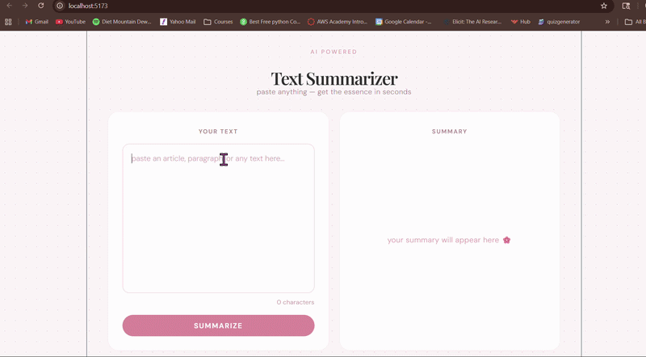

# ✨ AI Text Summarizer

A full stack AI-powered text summarizer built with React.js and Python FastAPI, using the Groq LLM API.

## 🌸 Features
- Paste any text and get a concise bullet-point summary instantly
- Two-panel layout — input on the left, summary on the right
- Real-time character count
- Soft aesthetic pink UI

## 🛠️ Tech Stack
- **Frontend:** React.js, Vite, CSS3
- **Backend:** Python, FastAPI, Uvicorn
- **AI:** Groq API (LLaMA 3.3 70B)

## 🚀 How to Run

### Backend
```bash
cd backend
pip install fastapi uvicorn groq python-dotenv
# Create a .env file and add: GROQ_API_KEY=your_key_here
python -m uvicorn main:app --reload
```

### Frontend
```bash
cd frontend
npm install
npm run dev
```
## 📸 Demo



---
*by Suhitha K — part of my 30-Day AI Learning Challenge 🌸*